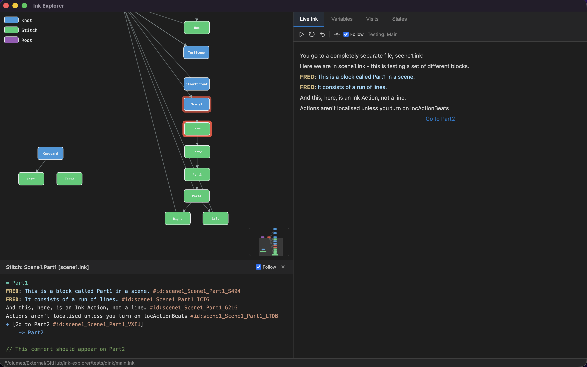
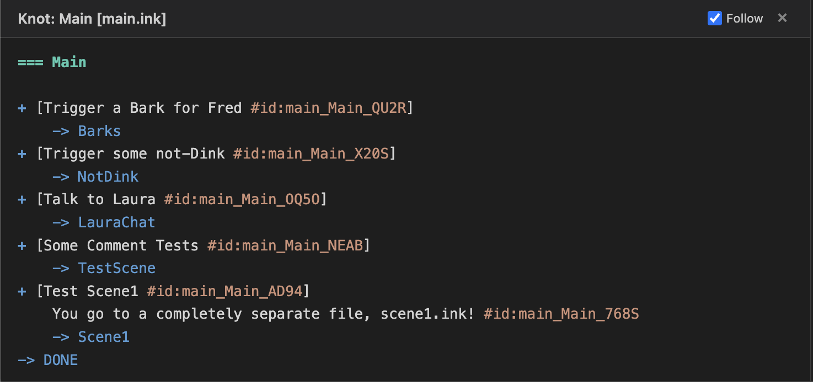
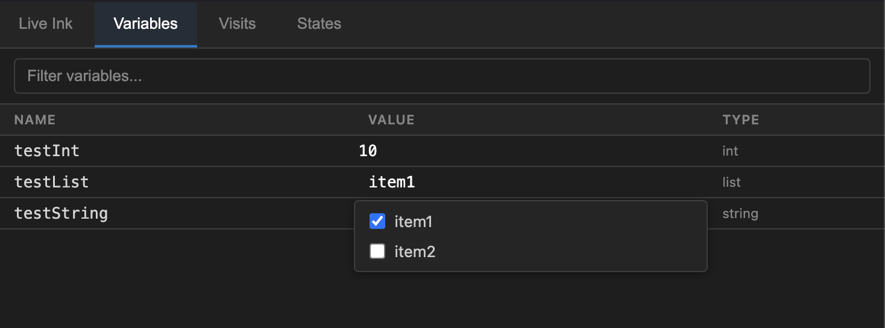
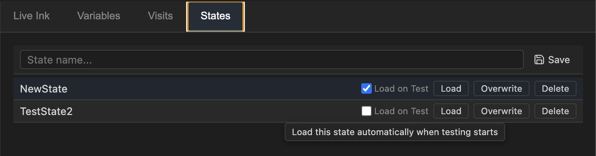

# Ink Explorer

**Ink Explorer** is a tool for visualizing and debugging [Ink](https://github.com/inkle/ink) stories. It allows you to explore the structure of your Ink code, play through it interactively, and inspect the state of your variables and visit counts in real-time.

It is built on [Inkle's](https://www.inklestudios.com/) code and uses the [inkjs](https://github.com/y-lohse/inkjs) project.

## Features

### Graph View

Ink Explorer generates a visual node graph of your Ink story, starting with a Root node (which represents the entrypoint of the Ink) and shows Knots and Stitches and how they connect.

- **Interactive Graph**: Click nodes to navigate the graph. Drag nodes to rearrange them.
- **Minimap**: navigate large graphs easily.
- **Visit Highlights**: The graph automatically highlights the nodes that have been visited. The brighter the red, the more recently it has been visited.

### Live Ink

Play through your story interactively within the tool. You can start your playthrough from any node in the graph, as if you had set a particular knot or stitch path when you started the story.

- **Choice Handling**: Make choices just like in a game.
- **Step Back**: Undo your last step to explore different outcomes.
- **Restart**: Quickly restart the story from the beginning or a specific node.
- **Bonus Dink Support**: Automatic formatting for "Dink" style dialogue tags.

If you have **Follow** ticked, the graph will automatically centre and follow the node your story is currently on.

### Code View

The code view shows the source code for any node in the graph.

You can toggle the code view off and on in the View menu.

- **Context Aware**: Click a node in the graph to see its source ink.
- **Follow Mode**: Automatically show the code for the current active node during playback.

### Variable Inspection

Inspect and edit global variables in real-time.

- **Search**: Filter variables by name.
- **Edit**: Modify variable values (Numbers, Strings, Booleans, Lists) on the fly to test different states.
- **Lists**: Full support for viewing and editing Ink Lists.

You need to have started a test for the variables to appear.

### Visit Tracking

Track exactly how many times each knot and stitch has been visited.

- **Real-time Updates**: Counts update as you play.

### States Management

Save and load the global variables and visit count of your story.

This is useful to take snapshots of a state to easily restore it, for testing.

- **Snapshots**: Capture the current story state (variables, path, visit counts).
- **Auto-Load**: Configure a state to automatically load when starting a test, effectively setting a "save point" for debugging.

## Releases

You can find releases for various platforms [here](https://github.com/wildwinter/Ink-Explorer/releases
).

## Usage

1. **Open an Ink File**: Use `File > Open...` to load your `.ink` file.
2. **Explore**: Use the graph to see the structure.
3. **Play**: Use the **Live Ink** tab to play through the story.
4. **Debug**: Use the **Variables** and **Visits** tabs to monitor state.

## Acknowledgements

Huge thanks to [Inkle](https://www.inklestudios.com/) for creating Ink, and to [Yannick Lohse](https://github.com/y-lohse) for `inkjs`.

## License and Attribution

This is licensed under the MIT license - you should find it in the root folder. If you're successfully or unsuccessfully using this tool, I'd love to hear about it!

You can find me [on Medium, here](https://wildwinter.medium.com/).
